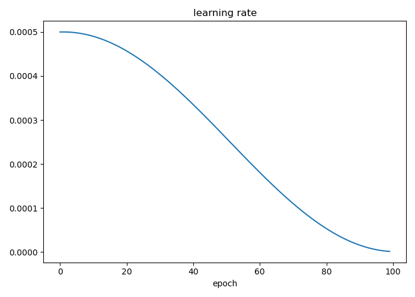
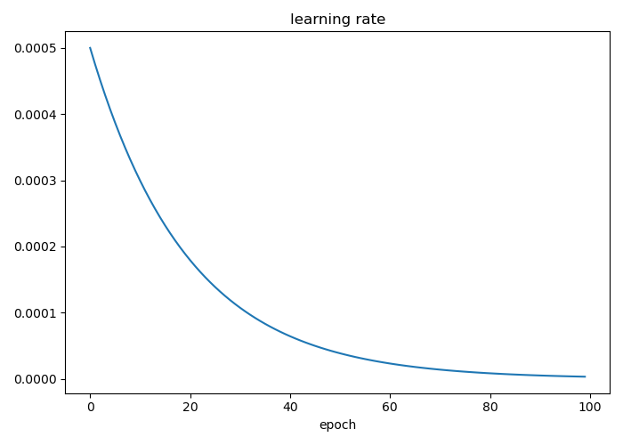
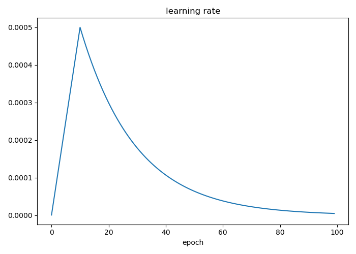

# pytorch-classifier  

image classifier implement in pytoch.

# Directory
1. **[Introduction](#Introduction)**
2. **[How to use](#Howtouse)**
3. **[Argument Explanation](#ArgumentExplanation)**
4. **[Model Zoo](#ModelZoo)**
5. **[Some explanation](#Someexplanation)**
6. **[TODO](#TODO)**
7. **[Reference](#Reference)**
8. **[Update Log](#Reference)**

## Introduction  

为什么推荐你使用这个代码?
- **丰富的可视化功能**  
  1. 训练图像可视化.
  2. 损失函数,精度,学习率迭代图像可视化.
  3. 热力图可视化.
  4. TSNE可视化.
  5. 数据集识别情况可视化.(metrice.py文件中--visual参数,开启可以自动把识别正确和错误的文件路径,类别,概率保存到csv中,方便后续分析)
  6. 类别精度可视化.(可视化训练集,验证集,测试集中的总精度,混淆矩阵,每个类别的precision,recall,accuracy,f0.5,f1,f2,auc,aupr)  
  7. 总体精度可视化.(kappa,precision,recll,f1,accuracy,mpa)

- **丰富的模型库**  
  1. 由作者整合的丰富模型库,主流的模型基本全部支持,支持的模型个数高达50+,其全部支持ImageNet的预训练权重,[详细请看Model Zoo.(变形金刚系列后续更新)](#ModelZoo)
  2. 目前支持的模型都是通过作者从github和torchvision整合,因此支持修改、改进模型进行实验,并不是直接调用库创建模型.

- **丰富的训练策略**
  1. 支持断点续训,只需要设定一个参数(--resume).
  2. 支持多种常见的损失函数.(目前支持PolyLoss,CrossEntropyLoss,FocalLoss)
  3. 支持一个参数即可设置类别平衡.
  4. 支持混合精度训练.(使你的机器能支持更大的batchsize)
  5. 支持[知识蒸馏](Knowledge_Distillation.md).

- **丰富的数据增强策略**
  1. 支持RandAugment, AutoAugment, TrivialAugmentWide, AugMix, Mixup, CutMix, CutOut, TTA等强大的数据增强.
  2. 支持添加torchvision中的数据增强.
  3. 支持添加自定义数据增强.[详细看Some explanation第十四点](#2)

- **丰富的学习率调整策略**  
  本程序支持学习率预热,支持预热后的自定义学习率策略.[详细看Some explanation第五点](#1)

- **支持导出各种常用推理框架模型**  
  目前支持导出torchscript,onnx,tensorrt推理模型.

- **简单的安装过程**  
  1. 安装好pytorch, torchvision(pytorch==1.12.0+ torchvision==0.13.0+)  
    可以在[pytorch](https://pytorch.org/get-started/previous-versions/)官网找到对应的命令进行安装.
  2. pip install -r requirements.txt -i https://pypi.tuna.tsinghua.edu.cn/simple

- **人性化的设定**
  1. 大部分可视化数据(混淆矩阵,tsne,每个类别的指标)都会以csv或者log的格式保存到本地,方便后期美工图像.
  2. 程序大部分输出信息使用PrettyTable进行美化输出,大大增加可观性.

## How to use
  
  1. 安装程序所需的[环境](#6).
  2. 根据[Some explanation中的第三点](#5)处理好数据集.

## Argument Explanation

- **main.py**  
  实现训练的主要程序.
  参数解释:
  - **model_name**  
    type: string, default: resnet18  
    选择的模型类型.
  - **pretrained**  
    default: False  
    是否加载预训练权重.  
  - **weight**  
    type: string, default: ''  
    载入权重的路径.跟pretrained没有关系,pretrained是自动从网上下载权重载入到模型中.[详细解释请看Some explanation中的第十一点](#4)
  - **config**  
    type: string, default: config/config.py  
    配置文件的路径.
  - **device**  
    type: string, default: ''  
    使用的设备.(cuda device, i.e. 0 or 0,1,2,3 or cpu)  
  - **train_path**  
    type: string, default: dataset/train  
    训练集的路径.
  - **val_path**  
    type: string, default: dataset/val  
    验证集的路径.  
  - **test_path**  
    type: string, default: dataset/test  
    测试集的路径.  
  - **label_path**  
    type: string, default: dataset/label.txt  
    标签的路径.  
  - **image_size**  
    type: int, default: 224  
    输入模型的图像尺寸大小.  
  - **image_channel**  
    type:int, default: 3  
    输入模型的图像通道大小.(目前只支持三通道)  
  - **workers**  
    type: int, default: 4  
    pytorch中的dataloader中的workers数量.  
  - **batch_size**  
    type: int, default: 64  
    单次训练所选取的样本个数,如果设置为-1则程序会计算当前使用的gpu最大的batch_size个数(占满gpu的百分之80),如果使用者电脑上没有gpu或者安装了cpu版本的pytorch,自动设置batch_size=16.  
  - **epoch**  
    type: int, default: 100  
    训练次数.  
  - **save_path**  
    type: string, default: runs/exp  
    用于保存训练过程、计算指标、测试过程的路径.  
  - **resume**  
    default: False  
    是否在save_path参数的路径中继续训练未完成的任务.  
  - **loss**  
    type: string, default: CrossEntropyLoss, choices: ['PolyLoss', 'CrossEntropyLoss', 'FocalLoss']  
    损失函数类型.  
  - **optimizer**  
    type: string, default: AdamW, choices: ['SGD', 'AdamW', 'RMSProp']  
    优化器类型.  
  - **lr**  
    type: float, default: 1e-3  
    学习率大小.  
  - **label_smoothing**  
    type: float, default: 0.1  
    损失函数中的标签平滑的值.  
  - **class_balance**  
    default: False  
    是否采用标签平衡.(使用sklearn中的compute_class_weight进行实现)  
  - **weight_decay**  
    type: float, default: 5e-4
    权重正则化.  
  - **momentum**  
    type: float, default: 0.9  
    优化器中的动量参数.  
  - **amp**  
    default: False
    是否使用混合精度训练.
  - **warmup**  
    default: False  
    是否采用学习率预热.  
  - **warmup_ratios**  
    type: float, default: 0.05  
    学习率预热中的预热比例.(warmup_epochs=int(warmup_ratios * epoch))  
  - **warmup_minlr**  
    type: float, default: 1e-6  
    默认学习率调整中学习率最小值,如果warmup设置了为True,也是warmup学习率的初始值.  
  - **metrice**  
    type: string, default: acc, choices:['loss', 'acc', 'mean_acc']  
    根据metrice选择的指标来进行保存best.pt.
  - **patience**  
    type: int, default:30  
    早停法中的patience.(设置为0即为不使用早停法)
  - **imagenet_meanstd**  
    default:False  
    是否采用imagenet的均值和方差,False则使用当前训练集的均值和方差.  
  - **mixup**  
    type:string, default: none, choices:['mixup', 'cutmix', 'none']   
    mixup数据增强及其变种的选择.  
  - **Augment**  
    type: string, default: none, choices: ['RandAugment', 'AutoAugment', 'TrivialAugmentWide', 'AugMix', 'none']  
    数据增强类型,none则为不增强.  
  - **test_tta**  
    default: False  
    是否采用测试阶段的数据增强.  
  - **kd**  
    default: False  
    是否进行知识蒸馏.  
  - **kd_method**  
    type: string, default: SoftTarget, choices: ['SoftTarget', 'MGD', 'SP', 'AT']  
    知识蒸馏类型. 
  - **kd_ratio**  
    type: float, default: 0.7  
    知识蒸馏损失系数.  
  - **teacher_path**  
    type: string, default: ''  
    知识蒸馏中老师模型的路径.  
  - **rdrop**  
    default: False 
    是否采用R-Drop.(不支持知识蒸馏)
  - **ema**  
    default: False  
    是否采用EMA.(不支持知识蒸馏)  
- **metrice.py**  
  实现计算指标的主要程序.  
  参数解释:  
  - **train_path**  
    type: string, default: dataset/train  
    训练集的路径.
  - **val_path**  
    type: string, default: dataset/val  
    验证集的路径.  
  - **test_path**  
    type: string, default: dataset/test  
    测试集的路径.  
  - **label_path**  
    type: string, default: dataset/label.txt  
    标签的路径. 
  - **device**  
    type: string, default: ''  
    使用的设备.(cuda device, i.e. 0 or 0,1,2,3 or cpu)  
  - **task**  
    type: string, default: test, choices: ['train', 'val', 'test', 'fps']  
    任务类型.选择fps就是单独计算fps指标,选择train、val、test就是计算其指标.
  - **workers**  
    type: int, default: 4  
    pytorch中的dataloader中的workers数量.  
  - **batch_size**  
    type: int, default: 64  
    单次测试所选取的样本个数.  
  - **save_path**  
    type: string, default: runs/exp  
    保存的模型路径,也是保存计算指标的路径.  
  - **test_tta**  
    default: False  
    是否采用mixup数据增强.  
  - **visual**  
    default: False  
    是否可视化数据集的识别情况,分别保存正确识别和错误识别的csv文件.  
  - **tsne**  
    default: False  
    是否可视化卷积层输出的tsne特征可视化.  
- **predict.py**  
  实现预测的主要程序.  
  参数解释:  
  - **source**  
    type: string, default: ''  
    检测的路径,支持图像文件和图像文件夹路径.  
  - **label_path**  
    type: string, default: dataset/label.txt  
    标签的路径.  
  - **save_path**  
    type: string, default: runs/exp  
    保存的模型路径,也是保存检测结果的路径.  
  - **test_tta**  
    default: False  
    是否采用测试阶段的数据增强.  
  - **cam_visual**  
    default: False  
    是否进行热力图可视化.(目前只支持在cpu上进行可视化热力图)  
  - **cam_type**  
    type: string, default: GradCAMPlusPlus, choices: ['GradCAM', 'HiResCAM', 'ScoreCAM', 'GradCAMPlusPlus', 'AblationCAM', 'XGradCAM', 'EigenCAM', 'FullGrad']  
    热力图可视化的类型.  
  - **device**  
    type: string, default: ''  
    使用的设备.(cuda device, i.e. 0 or 0,1,2,3 or cpu)  
- **processing.py**  
  实现预处理数据集的主要程序.  
  参数解释:  
  - **data_path**  
    type: string, default: dataset/train  
    完整的数据集存放路径.  
  - **label_path**  
    type: string, default: dataset/label.txt  
    生成的标签txt文件路径.
  - **val_size**  
    type: float, default: 0.2  
    验证集的比例.  
  - **test_size**  
    type: float, default: 0.2  
    测试集的比例.  
- **config/config.py**  
  一些额外的参数配置文件.  
  参数解释:
  - **lr_scheduler**  
    default: None  
    Example: lr_scheduler = torch.optim.lr_scheduler.CosineAnnealingLR  
    自定义的学习率调整器.  
  - **lr_scheduler_params**  
    default: {'T_max': 10,'eta_min': 1e-6}  
    Example: lr_scheduler_params = {'step_size': 1,'gamma': 0.95} (此处默认为lr_scheduler = torch.optim.lr_scheduler.StepLR)  
    自定义的学习率调整器的参数,参数需与lr_scheduler匹配.  
  - **random_seed**  
    default: 0  
    随机种子设定值.  
  - **plot_train_batch_count**  
    default: 5  
    训练过程可视化数据的生成数量.  
  - **custom_augment**  
    default: transforms.Compose([])  
    Example: transforms.Compose([transforms.RandomHorizontalFlip(p=0.5),transforms.RandomRotation(degrees=20),])  
    自定义的数据增强.  
- **export.py**  
  导出模型的文件.目前支持torchscript,onnx,tensorrt.  
  参数解释:
  - **save_path**  
    type: string, default: runs/exp  
    保存的模型路径,也是保存转换结果的路径.  
  - **image_size**  
    type: int, default: 224  
    输入模型的图像尺寸大小.  
  - **image_channel**  
    type:int, default: 3  
    输入模型的图像通道大小.(目前只支持三通道)  
  - **batch_size**  
    type: int, default: 1  
    单次测试所选取的样本个数.
  - **dynamic**  
    default: False  
    onnx中的dynamic参数.
  - **simplify**  
    default: False  
    onnx中的simplify参数.  
  - **half**  
    default: False  
    FP16模型导出.(仅支持GPU环境导出)
  - **verbose**  
    default: False  
    导出tensorrt时是否显示日志.
  - **export**  
    type: string, default: torchscript  choices: ['onnx', 'torchscript', 'tensorrt']  
    选择导出模型.
  - **device**  
    type: string, default: ''  
    使用的设备.(cuda device, i.e. 0 or 0,1,2,3 or cpu)  

## Model Zoo  

    目前支持的模型,也就是main.py中model_name中可以选择的模型.
  | model | model_name |
  | :----:| :----: |
  | resnet | resnet18,resnet34,resnet50,resnet101,wide_resnet50,wide_resnet101,resnext50,resnext101 resnest50,resnest101,resnest200,resnest269 |
  | shufflenet | shufflenet_v2_x0_5,shufflenet_v2_x1_0 |
  | mobilenet | mobilenetv2,mobilenetv3_small,mobilenetv3_large |
  | densenet | densenet121,densenet161,densenet169,densenet201 |
  | vgg | vgg11,vgg11_bn,vgg13,vgg13_bn,vgg16,vgg16_bn,vgg19,vgg19_bn |
  | efficientnet | efficientnet_b0,efficientnet_b1,efficientnet_b2,efficientnet_b3,efficientnet_b4,efficientnet_b5,efficientnet_b6,efficientnet_b7 efficientnet_v2_s,efficientnet_v2_m,efficientnet_v2_l |
  | nasnet | mnasnet1_0 |
  | vovnet | vovnet39,vovnet59 |
  | convnext | convnext_tiny,convnext_small,convnext_base,convnext_large,convnext_xlarge |
  | ghostnet | ghostnet |
  | repvgg | RepVGG-A0,RepVGG-A1,RepVGG-A2,RepVGG-B0,RepVGG-B1,RepVGG-B1g2,RepVGG-B1g4 RepVGG-B2,RepVGG-B2g4,RepVGG-B3,RepVGG-B3g4,RepVGG-D2se |
  | sequencer | sequencer2d_s,sequencer2d_m,sequencer2d_l |
  | darknet | darknet53,darknetaa53 |
  | cspnet | cspresnet50,cspresnext50,cspdarknet53,cs3darknet_m,cs3darknet_l,cs3darknet_x,cs3darknet_focus_m,cs3darknet_focus_l cs3sedarknet_l,cs3sedarknet_x,cs3edgenet_x,cs3se_edgenet_x |
  | dpn | dpn68,dpn68b,dpn92,dpn98,dpn107,dpn131 |
  | repghost | repghostnet_0_5x,repghostnet_0_58x,repghostnet_0_8x,repghostnet_1_0x,repghostnet_1_11x repghostnet_1_3x,repghostnet_1_5x,repghostnet_2_0x |

## Some explanation  
  1. 关于cpu和gpu的问题.  
    
    其根据device参数选择对应的device,如果设置了gpu,但是安装的是cpu版本的torch,其会使用cpu运行.
  2. 关于processing.py的一些具体解释.  

    这个文件帮助我们去划分一个数据集.
    我们需要把所有的分类好的图像数据放进去--data_path,假设--data_path设置为dataset/train
    例子:
        dataset/train/dog/*.(jpg, png, bmp, ...)
        dataset/train/cat/*.(jpg, png, bmp, ...)
        dataset/train/person/*.(jpg, png, bmp, ...)
        and so on...
    
    程序流程:
    1. 记录每个类别的文件夹名字保存到--label_path,默认为dataset/label.txt.
    2. 重命名每个类别的文件夹为数字索引.
    3. 按照设定比例分割数据集.

  

  3. 关于数据集的问题.  
    
    数据集存放路径建议严格按照本程序的要求.  
    1. 只有整个数据集,还没有划分训练,验证,测试集合.
      按照Some explanation中第二点进行操作.
    2. 已经划分好集合.
      分别把train,val,test集合放到dataset文件夹里面,然后在dataset.py里面新建一个label.txt,里面标志着0,1,2,3,...类别对应的名字.  
      注意一点,train,val,test里面的文件夹命名需要是数字0开始,然后如果类别数大于10,文件夹名字需要是从00,01,02,03,...,10.如果是大于100,则文件夹名字需要从000,001,002,...,100进行命名.这是由于在计算机中读取的顺序是string进行排序的,如果不进行补0,则会出现乱序,后面百分之99会出现类别对不上的问题.  
  4. 关于自定义模型的问题.  

    model文件夹内还有一些没有加载到utils.utils_model.py的select_model里面,有部分是因为没有预训练权重(当然没有预训练权重也是可以的,只不过使用的时候最好把pretrained参数设置为False),还有部分是过于冷门,如有需要可以自行添加.下面演示如何自己把网上的模型代码进行添加到本项目中.  
  
    比如我现在想添加一个vgg16,我们首先先把vgg实现的代码添加到model文件夹中,并命名为vgg.py.然后在model文件夹中的__init__.py中添加  
    from .vgg import *  
    在utils.utils_model.py的select_model函数里面的if else判断中添加以下代码  
    elif name == 'vgg16':
        model = models.vgg16(pretrained=pretrained)
        model.classifier[-1] = nn.Linear(in_features=model.classifier[-1].in_features, out_features=num_classes)
    其中这句  
    model.classifier[-1] = nn.Linear(in_features=model.classifier[-1].in_features, out_features=num_classes)  
    是重定义model中输出层的类别个数.这个model.classifier中的classifier是要根据模型的分类器的参数进行判断的,不是所有的模型都是model.classifier,这里介绍一下如何去通过模型代码进行判断不同模型之间它的这个model.xxx究竟是什么.当然我们以vgg代码为示例.下面是VGG模型的实现代码,我们只需要看__init__部分即可.  
    class VGG(nn.Module):
      def __init__(
          self,
          features: nn.Module,
          num_classes: int = 1000,
          init_weights: bool = True
      ) -> None:
          super(VGG, self).__init__()
          self.features = features
          self.avgpool = nn.AdaptiveAvgPool2d((7, 7))
          self.classifier = nn.Sequential(
              nn.Linear(512 * 7 * 7, 4096),
              nn.ReLU(True),
              nn.Dropout(),
              nn.Linear(4096, 4096),
              nn.ReLU(True),
              nn.Dropout(),
              nn.Linear(4096, num_classes),
          )
          if init_weights:
              self._initialize_weights()
    我们需要找到其分类器部分的定义,这里介绍几个判断方法.
    1. 找classifier,fc这些字眼的参数,大部分github上的规范代码,分类器都是classifier或者fc.  
    2. 寻找使用到num_classes的地方,我们这个num_classes可以理解为定义类别数的参数,我们这里VGG的实现就是使用num_classes这个名字来作为类别数的参数名字.对于其他不是num_classes,有可能是classes或者其他,需要根据具体代码进行判断.  
    找到定义后,还需要判断分类器是一个层还是一个Sequential,如果是一个Sequential,那么代码基本就是
    model.classifier[-1] = nn.Linear(in_features=model.classifier[-1].in_features, out_features=num_classes)
    如果是一个层,那么代码需要改为
    model.classifier = nn.Linear(in_features=model.classifier.in_features, out_features=num_classes)

    最后说明一下,github上搭建模型各种各样,没法举例全部说明,最好是理解一下代码的调用方式,这样才能应对各种各样的模型代码,然后导入到本项目中进行使用,而且导入方式也不是一成不变,只要成功导入的方式都是没有问题.  

    经过后续更新后,按照上述添加模型后还需要修改模型的前向传播部分代码以便适应后面的知识蒸馏和tsne可视化,所以需要使用者添加下列几个函数,

    # 前向传播函数,函数参数是x,need_fea.
    # x也就是网络的输入,need_fea需要指定默认参数False.
    def forward(self, x: torch.Tensor, need_fea=False) -> torch.Tensor:
        # 下列需要分两种情况.

        # 当need_fea为True时,需要返回block1-block4的特征,输入全连接层前的特征,最后网络的输出.
        if need_fea:
            features, features_fc = self.forward_features(x, need_fea)
            return features, features_fc, self.classifier(features_fc)
        # 当need_fea为False时,直接返回最后网络的输出.
        else:
            x = self.forward_features(x)
            x = self.classifier(x)
            return x

    # 这里面就比较复杂了.
    def forward_features(self, x, need_fea=False):
        # 当need_fea为True的时候,我们需要遍历features,让它自动把[4, 8, 16, 32]倍下采样的输出添加到features.
        # 然后再把卷积层的输出经过avgpool和flatten得到输入全连接层前的特征.
        # 返回features([4, 8, 16, 32]倍下采样的输出特征), x(输入全连接层前的特征).
        if need_fea:
            input_size = x.size(2)
            scale = [4, 8, 16, 32]
            features = [None, None, None, None]
            for idx, layer in enumerate(self.features):
                x = layer(x)
                if input_size // x.size(2) in scale:
                    features[scale.index(input_size // x.size(2))] = x
            x = self.avgpool(x)
            x = torch.flatten(x, 1)
            return features, x
        # 当need_fea为False的时候,我们就不需要遍历features.
        # 简单来说就是直接返回输入全连接层前的特征即可.
        else:
            x = self.features(x)
            x = self.avgpool(x)
            x = torch.flatten(x, 1)
            return x

    # 返回特征层最后一个block就可以.主要是做热力图可视化,当然也可以直接返回整个features.
    def cam_layer(self):
        return self.features[-1]
  
  

  5. 关于学习率调整的细节.  
    
    默认是使用warmuplr,也即是warmup参数设置为True.则学习率变化如下图所示:
  

    如果是warmup参数设置为False,则学习率变化如下图所示:
  

    当然可以自定义学习率变化,然后这个自定义学习率变化也可以与warmuplr混合使用,其在utils.config.py中进行自定义,在utils.config.py中lr_scheduler和lr_scheduler_params定义,需要注意的是lr_scheduler_params的值需要与lr_scheduler相匹配,lr_scheduler设置为None的时候,则为默认学习率调整(如上图所示warmup参数设置为False的情况).
    
    如果设置了自定义学习率调整(Steplr),warmup参数设置为False,则学习率变化如下图所示:
  
    
    如果设置了自定义学习率调整(Steplr),warmup参数设置为True,则学习率变化如下图所示:
  

  6. 关于随机种子的问题.  

    程序中所有的随机种子(torch,numpy,random)都给设置为0,需要修改的话可以在utils/config.py中进行修改random_seed.  
  
  7. 关于训练,测试,预测的文件路径问题.

    首先在main.py中的save_path是定义了训练的路径,期间训练过程的可视化,模型,日志等等数据都会保存到save_path路径中,然后测试和预测的save_path需要跟你模型的路径一样,比如我训练了一个vgg16模型在runs/vgg16,那么当你想在metrice.py和predict.py使用刚刚训练好的vgg16模型,你需要在metrice.py和predict.py中的save_path=runs/vgg16,而且期间metrice.py和predict.py都会保存在save_path(runs/vgg16)里面.还有一个就是训练的时候如果save_path已经存在的时候,会把文件夹进行覆盖,所以如果对同一个模型做调参对比实验,那请在save_path中标志好.  
  
  8. 关于训练过程生成的文件问题.

    还是vgg16的例子,假如我训练好vgg16到runs/vgg16里面,首先里面会有模型,配置文件,日志文件,你运行训练的main.py,preprocess.transforms(这个是数据的预处理文件,记录了归一化的一些参数,主要是在metrice.py和predict.py使用),train_batch.png(训练数据的可视化,默认生成5张图,如果不够可以在utils/config.py找到plot_train_batch_count参数进行修改),其余都是比较常见,就不一一讲解.

  9. 关于main.py中的--batch_size参数.  

    当gpu环境可用时和batch_size设置为-1时,其会计算占满百分之80的gpu显存的batchsize,这部分代码参考的是yolov5中auto_batchsize实现.  
    如果是cpu环境和batch_size设置为-1时,其会直接返回16作为batch_size.
  
  10. 关于数据预处理的问题.  

    1. 关于尺寸问题.  
      假如我设置image_size为224,对于训练集,其会把短边先resize到(224+224\*0.1)的大小,然后随机裁剪224大小区域.对于验证集或者测试集,如果不采用test_tta,其会把短边先resize到224大小,然后再进行中心裁剪,如果采用test_tta,其会把短边先resize到(224+224\*0.1)的大小,然后随机裁剪224大小区域.  
    2. 关于test_tta的问题.  
      这里采用的是torchvision中的TenCrop函数,其内部的原理是先(左上,右上,左下,右下,中心)进行裁剪,然后再把这五张图做翻转,作为最终的10张图返回,最后把预测结果求平均,相当于是一个集成预测的结果.
    3. 关于数据增强的问题.  
      本程序采用的是在线数据增强,自带的是torchvision.transforms中支持的数据增强策略(RandAugment,AutoAugment,TrivialAugmentWide,AugMix),在main.py中还有一个mixup的数据增强参数,其与前面的数据增强策略不冲突,假设我使用了AutoAugment+MixUp,那么程序会先对数据做AutoAugment然后再做MixUp.当然(RandAugment,AutoAugment,TrivialAugmentWide,AugMix)这些数据策略可能对某些数据并不合适,所以我们在utils/config.py中定义了一个名为custom_augment参数,这个参数默认为transforms.Compose([]),以下会有一个示例,如何制定自己的自定义数据增强.

      custom_augment = transforms.Compose([
          transforms.RandomHorizontalFlip(p=0.5),
          transforms.RandomRotation(degrees=20),
      ])

      在v1.1版本中更新了支持使用albumentations库的函数,具体可以看一下[Some explanation中的第十七点](#5)

      其实很简单,也就是当列表里面为空的时候,其会使用main.py中的--Augment参数,如果列表不为空的话,其会代替--Augment参数(无论--Augment设置了什么),也就是说两个参数只会生效一个.  
      当然自定义的数据增强与mixup也不冲突,也就是先做自定义数据增强,然后再做mixup.  
  
  

  11. 关于预训练权重和载入权重的问题.

    1. pretrained参数设置为True,其会自动从网上下载预训练权重载入到模型中.
    2. 当pretrained参数设置为True,weight参数路径不为空时,weight参数路径的权重会覆盖pretrained预训练权重.
    3. 当resume参数为True时,也就是继续上一次未完成的训练的时候,pretrained和weight都会忽略掉,载入上次未训练完的权重继续训练.
    4. pretrained参数设置为True,其会下载权重，并在控制台上显示Downloading: xxx to yyy,但是有些使用者网络不好会出现无法下载的情况,这时候可以把下载的链接xxx复制到迅雷或者网页中打开进行下载,然后复制到本机对应的位置yyy,或者直接在weight中定义也可以.

  12. 关于热力图的问题.

    1. 在predict.py中的--cam_type参数,可以选择各种各样的热力图计算方法,如果遇到这个效果不好可以进行更换,当然效果不好除了跟热力图的计算方法有关系之外还有是你选择的层.
    2. 在第一点中说到的层,热力图可视化需要选择层进行计算,这个是在predict.py中的cam_visual方法定义中进行定义.
      例如这样 cam_model = cam_visual(model, test_transform, DEVICE, model.cam_layer(), opt) 这个model.cam_layer()就是选择的层,默认就是卷积特征的最后一个layer,这个可以在model文件夹中的每个模型文件中的模型进行修改.
  
  13. 关于类别平衡的问题.

    本程序使用的是sklearn中的compute_class_weight中进行计算系数,但是当样本极其悬殊的情况下,类别数量少的类别的系数会非常大,可能会导致训练过程中模型优化异常,因此我们把计算好的系数进行开根.
  
  

  14. 关于自定义数据增强的问题.

    第十一点中说到的自定义数据增强,除了直接调用torchvision中的transforms库,还可以自行定义,下面给出一个例子:

    class CutOut(object):
      # 函数初始化
      def __init__(self, n_holes=4, length=16):
          self.n_holes = n_holes
          self.length = length

      # 这个函数写你要做的处理,也就是你希望这个自定义算子实现的功能,比如这里我实现的是CutOut.
      def __call__(self, img):
          img = np.array(img)
          h, w = img.shape[:2]
          mask = np.ones_like(img, np.float32)
          
          for n in range(self.n_holes):
              y = np.random.randint(h)
              x = np.random.randint(w)

              y1 = np.clip(y - self.length // 2, 0, h)
              y2 = np.clip(y + self.length // 2, 0, h)
              x1 = np.clip(x - self.length // 2, 0, w)
              x2 = np.clip(x + self.length // 2, 0, w)

              mask[y1:y2, x1:x2] = 0.0
          return Image.fromarray(np.array(img * mask, dtype=np.uint8))
      
      # 这个是return一个字符串,就是你这个算子的名字.
      def __str__(self):
          return 'CutOut'
    
    使用者可以在utils/utils_aug.py中实现好后,在config/config.py中进行导入,然后添加到自定义数据增强的list中即可.
  
  15. 关于resume的问题.  

    只要当resume的参数设置为True时,并且在save_path路径中找到last.pt,其会载入之前训练的全部参数进行训练,也就是意味着你当前main.py和config.py中的参数设置都无效.这个设定主要是防止参数覆盖和参数设置错乱的问题.
  
  16. 关于保存模型的问题.  

    默认保存最后的模型last.pt和验证集上精度最高(可以在main.py中的--metrice参数中进行修改)的模型best.pt.
  
  

  17. 关于如何使用albumentations的数据增强问题.  
    我们可以在[albumentations的github](https://github.com/albumentations-team/albumentations)或者[albumentations的官方网站](https://albumentations.ai/docs/api_reference/augmentations/)中找到自己需要的数据增强的名字,比如[RandomGridShuffle](https://github.com/albumentations-team/albumentations#:~:text=%E2%9C%93-,RandomGridShuffle,-%E2%9C%93)的方法,我们可以在config/config.py中进行创建:
    Create_Albumentations_From_Name('RandomGridShuffle')
    还有些使用者可能需要修改其默认参数,参数可以在其api文档中找到,我们的函数也是支持修改参数的,比如这个RandomGridShuffle函数有一个grid的参数,具体方法如下:
    Create_Albumentations_From_Name('RandomGridShuffle', grid=(3, 3))
    不止一个参数的话直接也是在后面加即可,但是需要指定其参数的名字.
  
  18. 关于export文件的一些解释.  
    1. tensorrt建议在ubuntu上使用,并且tensorrt只支持在gpu上导出和推理.  
    2. FP16仅支持在gpu上导出和推理.  
    3. FP16模式不能与dynamic模式一并使用.  
    4. 详细GPU和CPU的推理速度实验请看[v1.2更新日志](v1.2-update_log.md).

## TODO
- [x] Knowledge Distillation
- [x] EMA
- [x] R-Drop
- [ ] SWA
- [ ] DDP Mode
- [x] Export Model(onnx, torchscript, TensorRT)  
- [ ] C++ Inference Code  
- [ ] Accumulation Gradient  
- [ ] Model Ensembling  
- [ ] Freeze Training  
- [x] Support Fuse Conv and Bn  
- [x] Early Stop  

## Reference

  https://github.com/BIGBALLON/CIFAR-ZOO  
  https://github.com/okojoalg/sequencer  
  https://github.com/bubbliiiing/yolov4-pytorch  
  https://github.com/ultralytics/yolov5  
  https://github.com/DingXiaoH/RepVGG  
  https://github.com/d-li14/ghostnet.pytorch  
  https://github.com/rwightman/pytorch-image-models  
  https://github.com/stigma0617/VoVNet.pytorch  
  https://github.com/zhanghang1989/ResNeSt  
  https://github.com/jacobgil/pytorch-grad-cam  
  https://github.com/jahongir7174/PolyLoss  
  https://github.com/clovaai/CutMix-PyTorch  
  https://github.com/AberHu/Knowledge-Distillation-Zoo  
  https://github.com/yoshitomo-matsubara/torchdistill  
  https://github.com/albumentations-team/albumentations  

## Update Log
详细更新日志可以到[CSDN](https://blog.csdn.net/qq_37706472/article/details/128889634?spm=1001.2014.3001.5501)去看.

### pytorch-classifier v1.1 更新日志

- **2022.11.8**
    1. 修改processing.py的分配数据集逻辑,之前是先分出test_size的数据作为测试集,然后再从剩下的数据里面分val_size的数据作为验证集,这种分数据的方式,当我们的val_size=0.2和test_size=0.2,最后出来的数据集比例不是严格等于6:2:2,现在修改为等比例的划分,也就是现在的逻辑分割数据集后严格等于6:2:2.
    2. 参考yolov5,训练中的模型保存改为FP16保存.(在精度基本保持不变的情况下,模型相比FP32小一半)
    3. metrice.py和predict.py新增支持FP16推理.(在精度基本保持不变的情况下,速度更加快)

- **2022.11.9**
    1. 支持[albumentations库](https://github.com/albumentations-team/albumentations)的数据增强.
    2. 训练过程新增[R-Drop](https://github.com/dropreg/R-Drop),具体在main.py中添加--rdrop参数即可.

- **2022.11.10**
	1. 利用Pycm库进行修改metrice.py中的可视化内容.增加指标种类.

- **2022.11.11**
	1. 支持EMA(Exponential Moving Average),具体在main.py中添加--ema参数即可.
	2. 修改早停法中的--patience机制,当--patience参数为0时,停止使用早停法.
	3. 知识蒸馏中增加了一些实验数据.
	4. 修复一些bug.

### pytorch-classifier v1.2 更新日志

1. 新增export.py,支持导出(onnx, torchscript, tensorrt)模型.  
2. metrice.py支持onnx,torchscript,tensorrt的推理.  

        此处在predict.py中暂不支持onnx,torchscript,tensorrt的推理的推理,原因是因为predict.py中的热力图可视化没办法在onnx、torchscript、tensorrt中实现,后续单独推理部分会额外写一部分代码.
        在metrice.py中,onnx和torchscript和tensorrt的推理也不支持tsne的可视化,那么我在metrice.py中添加onnx,torchscript,tensorrt的推理的目的是为了测试fps和精度.
        所以简单来说,使用metrice.py最好还是直接用torch模型,torchscript和onnx和tensorrt的推理的推理模型后续会写一个单独的推理代码.
3. main.py,metrice.py,predict.py,export.py中增加--device参数,可以指定设备.
4. 优化程序和修复一些bug.

### pytorch-classifier v1.3 更新日志

1. 增加[repghost](https://arxiv.org/abs/2211.06088)模型.
2. 推理阶段把模型中的conv和bn进行fuse.
3. 发现mnasnet0_5有点问题,暂停使用.
4. torch.no_grad()更换成torch.inference_mode().

### pytorch-classifier v1.4 更新日志

1. predict.py支持检测灰度图,其读取后会检测是否为RGB通道,不是的话会进行转换.
2. 更新readme.md.
3. 修复一些bug.

### pytorch-classifier v1.5 更新日志

1. 更新readme.md
2. 修改predict.py中的读取模型方式.
3. 修复predict.py中批量预测保存图片时候的内存溢出问题.
4. 修复predict.py中热力图可视化的报错问题,但是目前只支持cpu状态下可视化热力图.